# 设计师 AI Coding 入门概览

> 目标 —— 面向 *设计部的全体同学* 的「方向性」整体介绍(2026.10):
> 1. **AI Coding** 当前发展状况
>
>    - AI Coding 能做到什么程度?
>    - 我适合什么类型的工具?
> 2. **设计师上手** 的学习曲线 & 应用场景
>
>    - 设计师 Coding 有什么用?
>    - 在职设计师应该以什么姿势入坑?

# Part 1 引入

> 对 AI Coding 形成合理的预期

### 1) 内外实例

早在 24年8月, 外网出现了一个火出圈的视频, 一个8岁小女孩半个小时用大白话在Cursor里做出了一个聊天机器人网站;

随后, 内外各地喷涌出现更多非技术人士用 AI Coding 独立开发的故事, 最出名的例子是“小猫补光灯”.

美团内部也有很多案例,  PM、运营、财务等角色使用 AI Coding 工具来开发demo、制作插件、生成分析报表, **自己解决身边的个性化需求**.

最近刚完结了设计部 AI Coding 作品征集, 各个业务的设计师“不清不楚”地进行了百花齐放的尝试, 产出了很多非常惊艳的产品.

... 其实这个过程, 包括上面提的例子, 大家都在「Vibe Coding」.

|  | 外部 | 内部 (仅保留示例, 需认证访问) |
| --- | --- | --- |
| 非设计师 | • [8岁小女孩用AI辅助 半小时做了一个 哈利波特聊天机器人](https://www.xiaohongshu.com/discovery/item/66cef3bc000000001f01d629?source=webshare&xhsshare=pc_web&xsec_token=ABWL7OPgLHm9IRqAcctV_L9bYiFgPmXAe1UTZO0apJjVU=&xsec_source=pc_share) • [小猫补光灯: 零基础产品经理用AI写App冲上了付费榜一](https://www.xiaohongshu.com/discovery/item/6729aba8000000001b010ac5?source=webshare&xhsshare=pc_web&xsec_token=AB063mAKt2OkX4BY4x7IxHHHH1CPikpADF2tYkGcHFCaA=&xsec_source=pc_share) | • [<u>20241225｜产品经理一周搞定小美iOS APP，小白也能写</u>](https://km.sankuai.com/collabpage/2663688834) • [<u>8小时 搞定美团十五周年 Keeta 沙特红包发放系统</u>](https://km.sankuai.com/community/article/2703503671) • [<u>大大前年的暗黑模式终于安排上了——关于用NoCode做插件这件事</u>](https://km.sankuai.com/community/article/2706524389) |
| 设计师 | • [https://ryo.lu/](https://ryo.lu/) 复古MacOS + 个人Agent + 全球聊天室 • [网页&移动双端 \| 时空穿梭机](http://xhslink.com/m/7p5LrUFJfPa)、[实机页面](https://longtravel.vercel.app/) • [figma插件 \| Markdown转设计标注 (设计师开发)](https://www.figma.com/community/plugin/1482294450395007313/markdown-to-figma) | • [<u>MasterGo AI插件使用说明 (设计师开发)</u>](https://km.sankuai.com/collabpage/2708878502) • [<u>2025 设计部 AI Coding 活动网站 (设计师开发)</u>](https://aicoding.meituan.com/) • [<u>2025 设计部 AI Coding 投稿作品(114个)</u>](https://aicoding.meituan.com/submissions) |

### 2) Vibe Coding 得与失

> **Vibe Coding** : 不写一行代码, 只用「自然语言」驱使 AI 编写程序, 遇到报错就贴给 AI 解决.

>
>
>

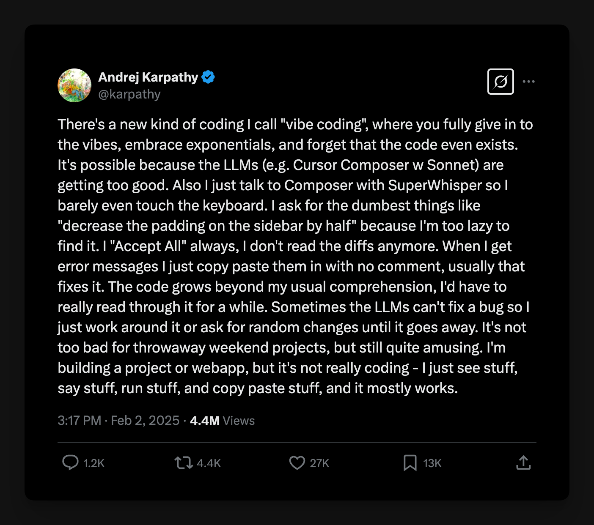

>

>
> “有一种新的编码方式，我称之为“Vibe Coding”，你完全沉浸于“Vibe”，拥抱AI生成的成果，甚至忘记代码的存在。
> 之所以会这样，是因为 LLMs（例如 Cursor Composer 和 Sonnet）现在越来越厉害了。而且我只用 SuperWhisper 和 Composer 对话，几乎不用碰键盘。我会要求一些最蠢的要求，比如“把侧边栏的 padding 减半”，因为我懒得去找它。我总是“All accept”，不再看代码的 diff 。
> 收到错误信息时，我会直接复制粘贴，不加任何注释，通常这样就能解决问题。代码量超出了我通常的理解能力，我得仔细读上一段时间。有时 LLMs无法修复 bug，所以我只能绕过它，或者要求一些随机的修改，直到问题解决。
> 对于一次性的周末项目来说，这还不算太糟，但仍然相当有趣。我正在构建一个项目或网络应用程序，但这并不是真正的编码 —— 我只是看到一些东西，说一些东西，运行一些东西，复制粘贴一些东西，而且它大部分都有效。”
>

>

Vibe Coding 为大众用户接触软件开发打开了新的大门, 让更多人更轻易的实现自己的想法.

但我们和工程师 Vibe Coding 有一个很大的不同: **工程师原本就会写大多数 AI 生成的代码**.

举2个换位思考的例子, 帮助大家更好理解 AI Coding 当前给人的感受:

1. 假设技术成熟了, 非设计序列的同事使用“Vibe Design”工具在同一个软件参与部分设计师的工作:

   - 一方面, 由于 AI 训练材料都来自最好的设计系统、组件库、规范绘制的页面, 它生成的图层结构、命名分组比你自己手捏的要规整很多, 而且生成速度很快、数量很多;
   - 另一方面, 由于用户没有完备的设计背景, ta *看不出* 也 *意识不到*「形而上的设计逻辑」, “这不是很好看么?”...... ta 考虑不到视觉层级、一致性乃至长期维护和协作的问题.

1. 换个角度, 如果设计的需求方不懂设计协作流程, 审美要求也不高:

   - **ta 不能准确描述自己的需求**: 需要多次试稿来确认想法;
   - **ta 不能对交付物形成准确的判断**: 60分的作品和80分的作品拼凑在一起, 但 ta 看不出来;
   - **ta 只会在遇到问题后反馈**: 只修复可见的局部问题, 每每治标不治本, 用120分精力解决100分的问题;

—— 有很高的执行成本、沟通成本, 对AI来说很费 token、对做事来说没有效率.

|  | 非技术 视角 | 工程师 视角 |
| --- | --- | --- |
| 好处 | 降低门槛, 把人从技术细节中解放出来、不需要理解复杂的技术概念, 专注于实现 idea & 解决问题 | 节省了大量以前需要复制粘贴、机械检索的工作, 强大补全能力降低了使用陌生技术的门槛 |
| 局限 | • **无法解决AI幻觉**: 描述不准确就无法实现复杂效果、复杂debug会陷入对话循环 • **积累长期“技术债务”**：忽视需要技术理解才能感知的隐患, 导致代码难以维护、协作和拓展  | • **牺牲代码质量&安全性**：未经仔细 review 的生成代码可能风格不一、性能低下、存在安全漏洞 • **对工程能力要求更高**: AI能快速完成代码编写, 反而需要人有更强的判断力、更强的系统规划能力 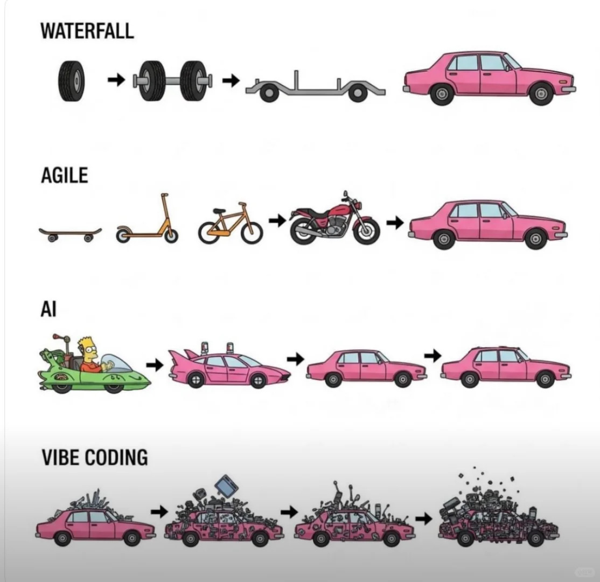 |

延展一: 相关专业人士对 Vibe Coding 是这样看的

| [Ryo](https://www.xiaohongshu.com/user/profile/56952168aed7580556a14c0d?xsec_token=ABHDOfjrUhEopo2LIMMQbNoUxTDIreTvd-MInjqofWP08%3D&xsec_source=pc_search&m_source=bingsem)(Cursor设计师) | 吴恩达[(原帖)](https://www.xiaohongshu.com/discovery/item/683d2903000000000c03ac24?source=webshare&xhsshare=pc_web&xsec_token=ABf4Tr8jTYRMkCX-wpCJ7dGZYBvBLjTtx3pZB4rKt70AQ=&xsec_source=pc_share) | Canva 创始人[(原贴)](https://www.xiaohongshu.com/discovery/item/68076ec6000000001d0250e8?source=webshare&xhsshare=pc_web&xsec_token=ABTqkfLLxvlLnN8c8htp-jLqx_tyVdiq6FC2wJAgmksg8=&xsec_source=pc_share) |
| --- | --- | --- |
| vibe coding確實很強大 但完全不懂技術想做出 production-ready 的東西還是很難的 我覺得 vibe coding 最大的價值是降低了入門門檻 讓設計師和產品經理能快速把想法變成prototype 但要做出真正穩定可維護的產品 你還是需要理解一些基本概念 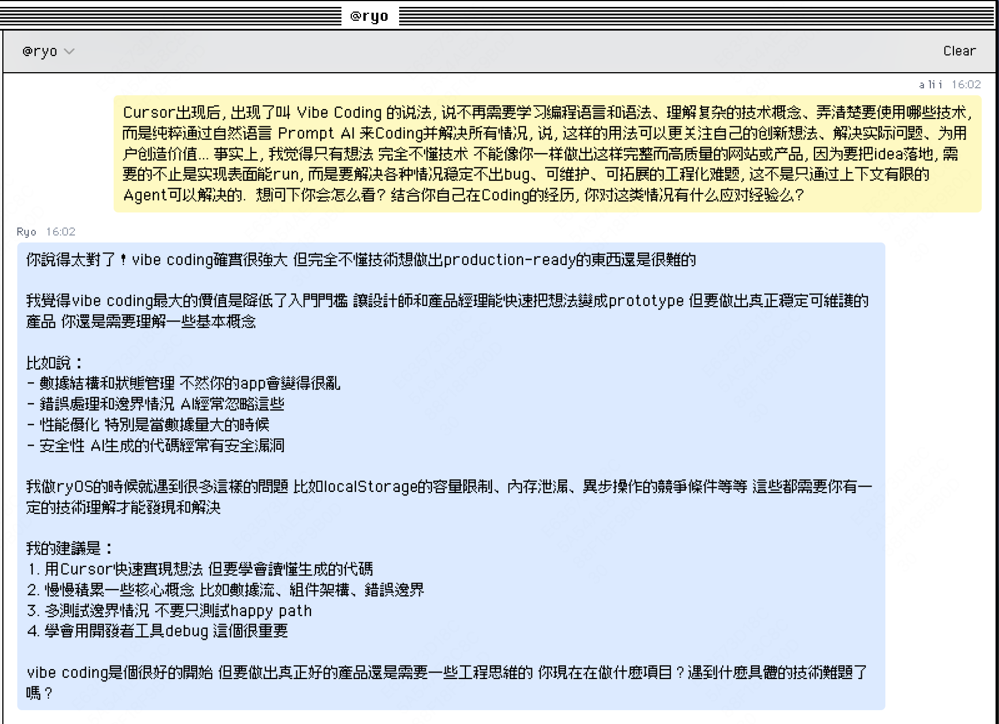 | Vibe Coding让人以为只需要凭感觉去做、接受或者拒绝就可以了。 坦白说，当我用 Vibe Coding 或者其他 AI 编程工具写一天代码的时候，我其实非常累。一天结束后你会发现，这其实是非常费脑筋的事情。 所以我觉得这个名字不太合适，但这种现象确实存在，而且发展得很快，这很好。 过去一年，有些人建议别人不要学编程，理由是 AI 会自动写代码。 我觉得回头来看，这可能是最糟糕的职业建议之一。因为在过去几十年里，编程变得越简单，学编程的人反而越多。 比如说，当年从打孔卡变成键盘和终端，或者从汇编语言变成 COBOL 的时候，就有人写文章说，“有了 COBOL 这么简单的语言，我们不需要程序员了”。 但很明显，编程越容易，学编程的人越多。 所以有了 AI 编程助手，应该有更多人去学写代码。 而且无论你是不是程序员，未来最重要的能力之一，就是你要能非常准确地告诉计算机你想要什么，这样它才能帮你实现。 我认为，大家都懂一些些，但如果能多了解一些计算机是怎么运作的，你下指令或者给提示的时候会更精确。 所以我还是建议每个人都学一门编程语言，比如 Python。 | 在Canva，我们基于对AI编码助手持续且广泛的评估得出结论：这些工具必须由经验丰富的工程师严格监督，尤其是在生产任务中。 工程师需要引导、评估、纠正并最终对输出代码负责，如同亲手编写每一行代码。 我们的实验反复证明，AI 工具生成的代码中存在从表面问题（风格不一致）到严重缺陷（错误、不安全或性能低下的代码）等各类错误。 目前，我们仅认可“Vibe Coding”在一个狭窄场景中的价值：快速验证概念的实验性代码（如原型或概念验证）。 这类代码最终会被丢弃。LLM辅助生成在快速测试和验证想法方面具有巨大潜力。 尽管LLM能力和上下文窗口迅速发展，我们仍持续重新评估对其输出的信任度。 但核心原则不变：优秀的软件工程要求工程师必须始终主导对工具输出的指导、评估和所有权。 |

延展二: “表面能跑”和“上线能用”的差别 —— 代码领域也有「可用性原则」

|  | 性能优化 (Performance) | 稳定性 (Reliability) | 错误处理 (Error Handling) | 边界情况适配 (Edge Cases) | 数据迁移 (Data Migration) | 版本兼容 (Version Compatibility) | 安全性 (Security) | 可观测性 (Observability) | 可拓展性 (Scalability) | 代码测试 (Testability) | 代码可读性 | 部署和回滚策略 |
| --- | --- | --- | --- | --- | --- | --- | --- | --- | --- | --- | --- | --- |
| 原 型 | `// 原型：每次都重新計算` `function getFilteredData() {` `return largeDataset.filter(item => item.active)` `.map(item => processItem(item));` `}` | `// 原型：直接調用API` `const response = await fetch('/api/data');` `const data = response.json();` | `// 原型：假設一切正常` `function saveUserData(userData) {` `localStorage.setItem('user', JSON.stringify(userData));` `}` | `// 原型：假設用戶正常使用` `function displayUserName(user) {` `return 'Hello, ${user.firstName} ${user.lastName}!';` `}` | `// 原型：直接使用新格式` `const userData = JSON.parse(localStorage.getItem('user'));` | `// 原型：假設所有瀏覽器都支持新API` `navigator.clipboard.writeText(text);` | `// 原型：直接信任用戶輸入` `const userInput = req.body.message;` | `// 原型：出錯了不知道` `function saveData(data) { ... }` | `// 原型：硬編碼處理邏輯` `function processUsers() {` `const users = getAllUsers();` `// 假設100個用戶` `users.forEach(user => {` `sendEmail(user.email, generateReport(user));` `});` `}` | 手动点点看 | 只有自己看得懂 | 直接替换所有代码, 上传新版本 -> 所有用戶立即看到变化 |
| 生 产 级 代 码 | `// Production：緩存和優化` `const cache = new Map();` `function getFilteredData() {` `if (cache.has('filtered')) return cache.get('filtered');` `const result = largeDataset.filter(item => item.active)` `.map(item => processItem(item));` `cache.set('filtered', result);` `return result;` `}` | `// Production：重試機制和超時` `async function fetchWithRetry(url, maxRetries = 3) {` `for (let i = 0; i < maxRetries; i++) {` `try {` `const response = await fetch(url, { timeout: 5000 });` `if (!response.ok) throw new Error('Network error');` `return await response.json();` `} catch (error) {` `if (i === maxRetries - 1) throw error;` `await sleep(1000  i);` `// 指數退避` `}` `}` `}` | `// Production：考慮各種失敗情況` `function saveUserData(userData) {` `try {` `if (!userData) throw new Error('No data provided');` `if (typeof userData !== 'object') throw new Error('Invalid data type');` `const serialized = JSON.stringify(userData);` `if (serialized.length > 5  1024  1024) {` `throw new Error('Data too large for localStorage');` `}` `localStorage.setItem('user', serialized);` `logger.info('User data saved successfully');` `} catch (error) {` `logger.error('Failed to save user data', error);` `// 降級方案：保存到內存或提示用戶` `fallbackSave(userData);` `}` `}` | `// Production：考慮各種奇怪情況` `function displayUserName(user) {` `if (!user) return 'Hello, Guest!';` `const firstName = user.firstName?.trim() \|\| '';` `const lastName = user.lastName?.trim() \|\| '';` `// 處理只有一個名字的情況` `if (!firstName && !lastName) return 'Hello, User!';` `if (!lastName) return 'Hello, ${firstName}!';` `if (!firstName) return 'Hello, ${lastName}!';` `// 處理超長名字` `const fullName = '${firstName} ${lastName}';` `return fullName.length > 50` `? 'Hello, ${fullName.substring(0, 47)}...!'` `: 'Hello, ${fullName}!';` `}` | `// Production：處理舊版本數據格式` `function loadUserData() {` `const rawData = localStorage.getItem('user');` `if (!rawData) return null;` `const userData = JSON.parse(rawData);` `// 檢查數據版本` `if (!userData.version) {` `// v1 -> v2: 添加新字段` `userData.preferences = { theme: 'light' };` `userData.version = '2.0';` `saveUserData(userData);` `// 自動升級` `}` `if (userData.version === '2.0') {` `// v2 -> v3: 重構數據結構` `userData.settings = {` `...userData.preferences,` `notifications: true` `};` `delete userData.preferences;` `userData.version = '3.0';` `saveUserData(userData);` `}` `return userData;` `}` | `// Production：檢測瀏覽器能力並降級` `function copyToClipboard(text) {` `// 現代瀏覽器` `if (navigator.clipboard && navigator.clipboard.writeText) {` `return navigator.clipboard.writeText(text);` `}` `// 舊瀏覽器降級方案` `const textArea = document.createElement('textarea');` `textArea.value = text;` `document.body.appendChild(textArea);` `textArea.select();` `try {` `document.execCommand('copy');` `return Promise.resolve();` `} catch (err) {` `return Promise.reject(new Error('Copy not supported'));` `} finally {` `document.body.removeChild(textArea);` `}` `}` | `// Production：要防XSS、SQL注入等` `const userInput = sanitize(req.body.message);` `if (userInput.length > 1000) throw new Error('Too long');` | `// Production：要記錄日誌、監控指標` `function saveData(data) {` `logger.info('Saving data', { userId, dataSize });` `metrics.increment('data.save.attempts');` `// ...` `}` | `// Production：考慮大量數據的處理` `async function processUsers() {` `const BATCH_SIZE = 50;` `let offset = 0;` `while (true) {` `const users = await getUsersBatch(offset, BATCH_SIZE);` `if (users.length === 0) break;` `// 並行處理但限制並發數` `await Promise.all(` `users.map(user =>` `rateLimiter.execute(() =>` `sendEmail(user.email, generateReport(user))` `)` `)` `);` `offset += BATCH_SIZE;` `await sleep(100);` `// 避免壓垮服務器` `}` `}` | 要写并运行单元测试、集成测试`// 測試代碼` `test('should save valid user profile', async () => {` `const mockApi = { post: jest.fn().mockResolvedValue({ id: 1 }) };` `const mockNotifications = { show: jest.fn() };` `const service = new UserService(mockApi, mockNotifications);` `await service.saveUserProfile({ email: 'test@test.com', name: 'Test' });` `expect(mockApi.post).toHaveBeenCalledWith('/user', { email: 'test@test.com', name: 'Test' });` `});` | 让团队其他人也能维护 • 写注释 • 规范格式和引用路径 • 按模块收纳文件夹 • 单文件不超过200行 | 要考虑灰度发布、快速回滚`// Production：漸進式部署` `class FeatureFlag {` `constructor() {` `this.flags = new Map();` `}` `// 根據用戶ID決定是否啟用新功能` `isEnabled(featureName, userId) {` `const flag = this.flags.get(featureName);` `if (!flag) return false;` `// 灰度發布：只對10%用戶啟用` `if (flag.rolloutPercentage) {` `const hash = this.hashUserId(userId);` `return hash % 100 < flag.rolloutPercentage;` `}` `return flag.enabled;` `}` `hashUserId(userId) {` `// 簡單的hash函數，確保同一用戶總是得到相同結果` `return userId.split('').reduce((a, b) => {` `a = ((a << 5) - a) + b.charCodeAt(0);` `return a & a;` `}, 0);` `}` `}` `// 使用例子` `function renderDashboard(userId) {` `const featureFlags = new FeatureFlag();` `if (featureFlags.isEnabled('newDashboard', userId)) {` `return renderNewDashboard();` `// 新版本` `} else {` `return renderOldDashboard();` `// 舊版本，出問題可以快速切回` `}` `}` |

> 因此:
> - 如果只要求“能用就行”, 并且能接受“技术债务”带来的潜在风险, 那 100% Vibe Coding 是性价较高的选择
> > —— AI 能提高人的「下限」
> - 如果想进一步, 做稳定可维护、业务可上线的“生产级产品”, 就要在「效率」和「质量」上接近专业开发者, 掌握必要的知识和思维
> > —— AI 不能提高人的「上限」, 仍然取决于个人水平

---

# Part 2  AI Coding 工具概览

> 应该如何判断我适合哪个工具?

### 1) 发展阶段

> 复杂的 AI Coding 产品也是从简单的对话式 AI 一步一步发展而来的

| 阶段 \ 对比 |  | 产品形态 | 用法 | PMF场景 | 局限性 |
| --- | --- | --- | --- | --- | --- |
|  | **2023年: **对话式 Copilot > 确实能用了 | 基于原有 IDE 嵌入对话侧栏 | • **输入**: 手动码入/贴入 Prompt • **生成**: 单轮答复 • **采用**: 复制粘贴手动插入 | 提供「代码片段」建议 | • 上下文输入有限 • 生成代码量有限 |
|  | **2024年: **原生 AI IDE > 不敢想象前人是怎么Coding的 | 基于 AI 功能重新构建 IDE | • **输入**: 上下文引用、自动补全、行内编辑 • **生成**: 自动流式插入代码 • **采用**: diff预览、一键采纳、回退机制 | 半自动辅助「多代码模块」编码 | • 记忆容量有限, 大规模持续生成效果不好 |
|  | **2025年: **AI Coding Agent > AI 能帮我们完成所有编码工作吗? | 弱化 IDE, 以“对话+预览”为主体 | • **输入**: 导入多格式&多渠道附件、设定Plan • **生成**: 目标导向的多步骤执行, 识别意图自主获取上下文、自动debug • **采用**: 自动构建上下游环境(安装依赖/运行预览/配置部署等), 一键发布 | 胜任小规模「完整项目」编码 | • 技术栈/平台限制, 不适配存量大型项目 • 生成-反馈周期长, 不便于敏捷精细调试 |

2023年, Coding 领域的 AI 应用和大家熟悉的 Chat GPT、豆包、小美非常相似

—— 在外置的对话侧栏, 一来一回地通过输入框交换信息.

2024年,  Cursor 让 AI Coding 真正出圈, 并带来了范式的转变.

从“能用”到“离不开”, 关键的变化是:

1. **AI 更懂代码和人的需求:**  *引用上下文*、*行内编辑* 等便利的输入方式和工程性优化;
2. **人可以更流畅地采用代码:**   *自动Apply*、*Diff预览*、*自动补全 、Restore回退* 等深度的交互集成.

这些特性解放了模型的性能, 让 AI 主导 Coding 成为了可能.

既然如此, AI 能帮我们完成所有 Coding 工作吗?

2025年, v0、Devin 为代表的产品,  以弱化IDE的“对话+预览”形态, 简化了大量复杂环节:

1. **对话 - 更简单直白的功能指令**: 舍弃了复杂的上下文调用, 提供 *上传附件*、*指定修改*、*一键接入* 等;
2. **预览 - 一键交付的操作配置**: 终点从“采纳代码”变为“部署上线”, 弱化代码展示, 提供 *自动预览页面*、*一键发布* 等.

这类产品对非技术背景的朋友上手门槛最低.

> 详细的交互模式对比 —— 注: 非严格划分, 仅提炼特征便于理解
>
>

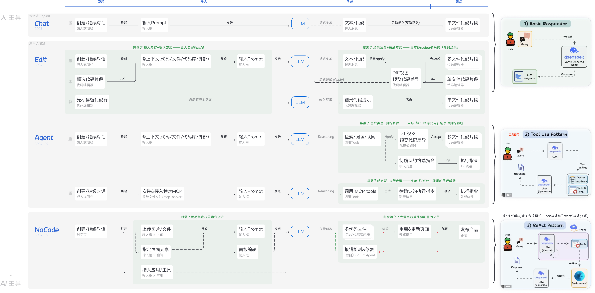

### 2) 品类鉴赏

设计师上手视角的产品图谱如下 —— 仅区分象限, 无精确程度区分

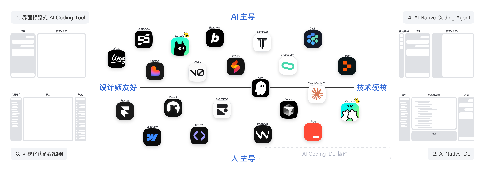

现阶段, 组合使用 Agent 类产品、AI 代码编辑器 效果最佳,  如从0到1的网页开发:

1. NoCode 搭建框架+部署环境 —— 节省布设代码仓库+安装依赖的功夫
2. Cursor 精调样式、实现复杂逻辑 —— 充分实现想要的效果
3. 同步回 NoCode, 借平台部署发布 —— 免审批、免配置最短流程

推荐从「1」上手, 逐步转变到「2」......若有进一步探索的兴致, 可尝试 「3」以及比较前沿的「4」.

| 对比维度 | • 界面预览式 AI Coding Tool | • AI Native IDE | • 可视化代码编辑器 | • AI Native Coding Agent |
| --- | --- | --- | --- | --- |
| 代表 | [NoCode](https://nocode.cn/)、[v0.dev](https://v0.dev/)、[Lovable](https://lovable.dev/)、[Bolt.new](https://bolt.new/)、[Same.new](https://same.new/)、[Macaly](https://www.macaly.com/)... | [Cursor](https://same.new/)、[Catpaw](https://mcopilot.sankuai.com/)、[Windsurf](https://windsurf.com/)、[Trae](https://www.trae.ai/)... | [Onlook](https://mcopilot.sankuai.com/)、[Subframe](https://www.subframe.com/)、[Reweb](https://www.reweb.so/)、[Framer](https://framer.com/)、[Webflow](https://webflow.com/)... | [Devin](https://devin.ai/)、[Replit](https://replit.com/)、[Tempo.ai](https://www.tempolabs.ai/#ai)、Cluade Code... |
| 定位受众 | 零代码端到端程序生成, 服务于 PM、设计师等快速生成原型和网页 | 面向专业开发者, 适合构建生产级应用 | 面向设计师 / 前端人员, 无需大量 Coding 即图形化搭建基于代码的 UI | 零代码端到端程序生成, 面向需完整程序开发的团队用户 |
| 核心面板 | 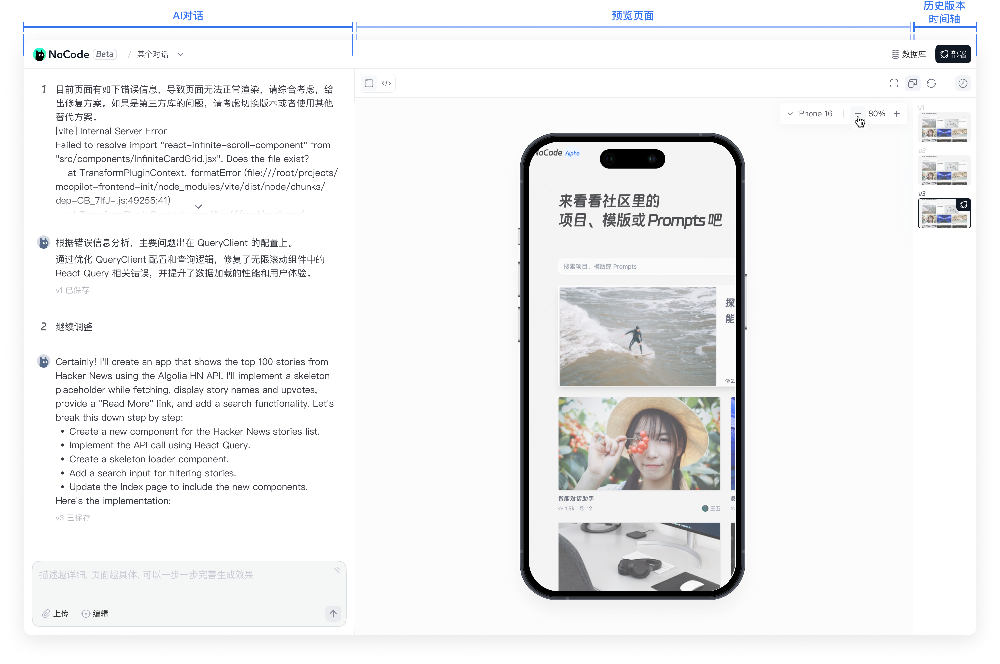 | 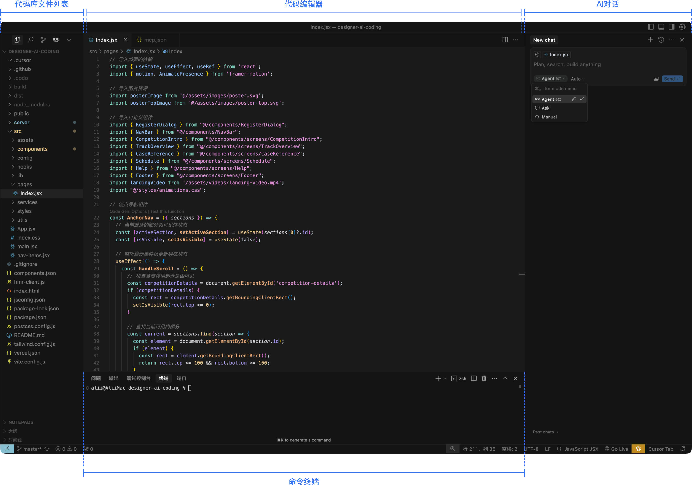 | 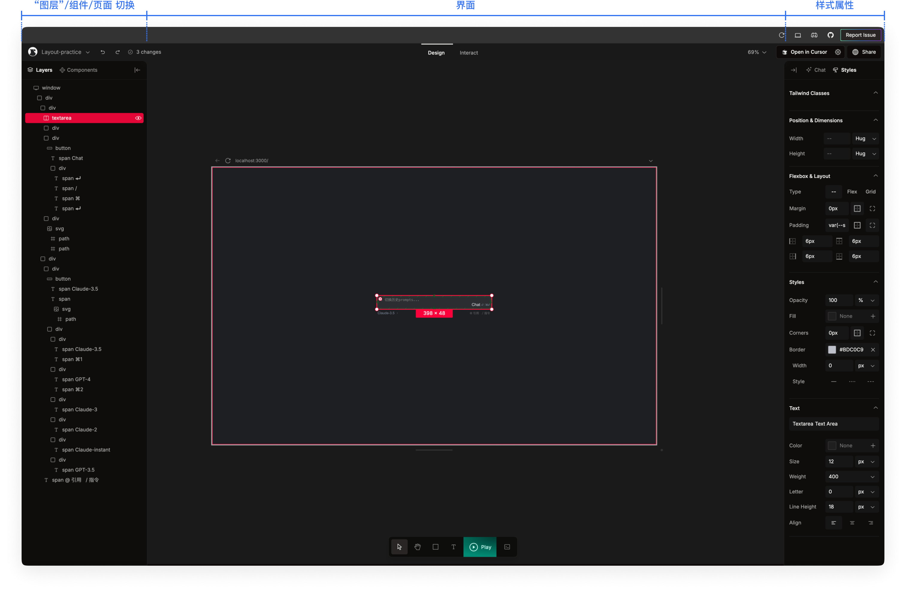 | 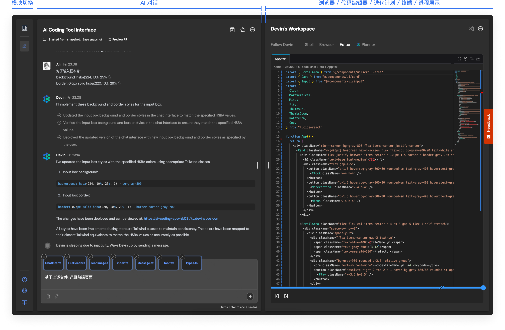 |
| 核心用法 | • **创建**: 在首页通过对话创建, 暂不支持导入代码仓库 • **编辑**: 通过对话/功能按钮, 编辑 *以代码为基底 *的页面 • **预览**: 内置预览窗口, 修改即更新 • **部署**: 右上角 一键部署发布 | • **创建**: 支持接入存量代码仓库 • 手动: 基于平台&技术栈, 部署环境-安装依赖-创建 • 自动: 可通过对话让 AI 执行前者完成创建; • **编辑**: 可通过对话让 AI 修改、可手动自主修改 • **预览**: 需手动启动, 可通过对话让AI启动预览、调试环境 run dev 预览 • **部署**: 不提供部署发布服务, 需自行部署 • 内部: 依靠Talos、导入NoCode等方式部署 • 外部: Github Pages、Vercel等支持免费部署, 有信安风险 | • **创建**: 可选择从空白或模版创建项目 • **编辑即预览**: • 左侧 > Layer: 定位元素结构, 可拖拽编辑组件; 不可命名, 是 DOM 结构 • 左侧 > Component: 可拖拽插入现成的组件 • 右侧 > Styles: 对选定元素通过面板调设样式属性 • 右侧 > Chat: AI 对话, 让 AI 提供建议、简单编辑 • **采用**: 不提供部署发布服务, 右上角可查看 / 导出源码、转到 IDE 编辑 | • **创建**: 在首页通过对话创建, 部分产品支持导入代码仓库 • **执行**: • 基于用户输入生成 Plan • 安装依赖、生成文件、运行测试、自动预览 • 执行中可插入对话补充需求, 会智能更新 Plan • **预览**: 内置预览, 随修改即时更新 • **采用**: 不提供部署发布服务, 可导出源码、转到 IDE 编辑 |
| 关键场景 | • **版本保存与管理**: 右侧历史版本侧栏 —— 自动记录, 单击预览, 双击回退 • **替换美术素材**: 输入框 > 编辑 —— 指定对象后, 上传*图片*, 说明替换 • **页面样式精调**: 输入框 > 编辑 —— 指定对象后, 在样式面板进行参数设置 | • **版本保存与管理**: • Git —— 针对代码仓库维度的版本管理, 需手动提交、管理分支 • Restore —— 基于对话, 针对 AI 变更的撤回 • **替换美术素材**: 向AI说明意图, 创建对应的文件夹(通常在src/assets下) —— 将本地素材拖入对应文件夹, 让 AI 完成素材调用, 支持*图片、图标、音频、视频、字体 *等各种素材 • **页面样式精调**: 指定文件/代码片段后, 说明意图 | • **版本保存与管理**: 在线自动保存, 与在线协作软件一致 • **替换美术素材**: 选中元素 - 上传素材 - 设置展示规则, 较精准 • **页面样式精调**: 选中元素 - 右侧样式面板进行参数设置, 较精准 | • **版本保存与管理**: 与 Cursor 基本一致的 Restore 机制 • **替换美术素材**: 输入框 —— 上传素材, 说明意图 • **页面样式精调**: 指定文件/代码片段后, 说明意图 与 AI IDE 用法一致, 但翻阅代码不方便, 对准确指定对象带来一定困难 |
| 优势 | **小白友好**: 上手门槛低, 快速搭建和部署 | **生产力工具**: 能力齐全、上下文理解强、补全速度快, 专业开发者高度好评 | **设计师友好**: 用编辑图层的操作形式编码前端, 设计既开发, 所见即所得 | 自主编码, 设计-部署全覆盖; 云端即用, 零本地环境 |
| 局限 | • **未达到生产级要求**: 过度简化的操作逻辑会限制复杂功能的实现（如数据状态管理、用户交互条件）, 难以扩展到生产级 • **技术栈限制**: 一体化生成依赖成熟的模型训练, 目前只有特定技术框架支持该模式(React+Tailwind等) • **存量迭代不友好**: 更适合从0到1生成特定 AI 友好结构的项目, 若规模过大、技术栈不兼容、仓库格式不标准, 难以导入使用 | 对设计师来说 • **工具门槛**: 要熟悉IDE的操作、适应工程师的使用习惯(快捷键/终端命令/项目打开方式/插件安装/系统设置...) • **环境门槛**: 不会自动安装项目需要的依赖、接入API, 需要自己管理Git、外部部署、管理代码结构... • **认知门槛**: AI 的意图识别和自动补全不是万能的, 不能准确描述需求就难以实现预期效果 | • **存量迭代不友好:** 适合从0到1、独立部署的网页; 注意甄别不同产品的前端技术栈限制 • **复杂逻辑不支持**: 除 Framer 外, 其他产品处理复杂交互、炫酷效果的能力弱/不成熟，不适于精细效果实现 | • 产品形态未成熟, 变动快 • 面向团队用户, 收费较高 • 深度封装的AI进程反馈周期长(1小时左右), 不便于人为介入敏捷精调 |

---

# Part 3 设计师 Coding 指北

> 会到什么程度, 可以做到哪些事情?

### 1) 落地场景&意义

1. **精准还原**：可以精确地把自己的设计融入到开发的每一个细节，从网格系统到设计稿到DEMO到成品，1%的误差都不会有，代码完美还原设计稿
2. **自带像素眼**：会设计的前端，各种界面尺寸、数据烂熟于心，每个界面参数都有出处和根据，任何一个px都不会错，眼睛就是网格，很细微的缺陷都能发现，靠“审美”和“感觉“去确定Margin/Padding/Size？不存在的
3. **极高效率**：设计稿就是代码，设计稿想怎么画、动效想怎么做，直接上代码，效率更甚于设计软件，双边熟练后精力很少会浪费在masterGo、figma、xd、ae...各种设计和开发沟通，更别说线框图
4. **创作自由**：凭借多年的设计阅历，加上前端实力，可以把很多从未见过的创造性想法通过代码变现，特别是软件很难模拟和表达的实时效果、交互细节，通过代码能效率成几何递增地迅速出原型

......对于 AI Coding 入门选手, 可独立完成一些 *无后端、无复杂部署* 的「独立产品」:

|  |  |  |
| --- | --- | --- |
| 场景 | 特点 | [例子](https://aicoding.meituan.com/submissions)(包括但不限于, 需认证访问) |
| • 个人网站 / 独立产品 | 纯静态前端开发, 没有后端, 无需多人协作 | • [数科设计团队的专属空间](https://msstest.vip.sankuai.com/static-test01/com.sankuai.mtdv.mpa.static-swimlane-1952-machx/index.html) • [和玛露西尔一起专注](https://designersem.github.io/FocusWithMalucelle/)(外部部署, 可访问) • [设计师印迹订单打印机](https://km.sankuai.com/collabpage/2712097892) |
| • 解决身边问题的插件 > 浏览器 / 设计稿 / 软件脚本.. | 功能简单, 本地安装使用, 无需部署 | • [MG插件 \| 秒绘](https://km.sankuai.com/collabpage/2708878502) • [MG插件 \| Master Selector插件使用说明](https://km.sankuai.com/collabpage/2712510461) • [figma插件 \| Markdown转设计标注](https://www.figma.com/community/plugin/1482294450395007313/markdown-to-figma)(外部, 可访问) |

当具备一定熟练度和代码掌控力, 就能在「业务中」参与*多人协作、对外上线* 的模块开发:

| 场景 | Before | After | 例子 (包括但不限于, 需认证访问) | 价值 |
| --- | --- | --- | --- | --- |
| 设计验收 | 录入+沟通, 验收了2-5pd+ ...... “尝试通过视频电话教会直男化妆” | **解放低效沟通**: 别掰扯了, 设计师对间距、色值了如指掌, 半天改完提PR | • [医药弹窗文案一致性优化开发](https://km.sankuai.com/collabpage/2710116245) • [feat: 优化组件样式和布局, 修改部分文本内容以提升用户体验](https://dev.sankuai.com/code/repo-detail/ee/mcopilot-nocode/commit/606a9a924f63bcc3422e4b7914856ff7274e5a11?branch=refs%2Fheads%2Frelease%2Fexternal-mvp&currentPath=nocode-ui%2Fsrc%2Fpages%2Fcomponents%2FChatInput.tsx) | 🌟 减少成本&沟通导致的「设计磨损」, 让好的设计更容易落地 |
| 设计交付 | 我们提出了一些体验优化🙏 ...... “排期半年后, 先卷一下文档吧” | **存量优化不卡资源**: 上下都觉得ok, 拉取代码直接开干 | • [feat: 优化ChatHeader组件，增加对话标题的编辑功能，支持双击编辑和失去焦点保存，提升用户交互体验](https://dev.sankuai.com/code/repo-detail/ee/mcopilot-nocode/commit/973281086b8771964a3db7c4af6c9508ab9ebb77?branch=refs%2Fheads%2Frelease%2Fexternal-mvp) • [feat: 增加文本可读性，优化了BasicInfo、ChatHeader、ShareInfo和OperationButtons的布局和样式，提升用户体验](https://dev.sankuai.com/code/repo-detail/ee/mcopilot-nocode/commit/0c836fe348e4476416d19d5f2b91585db9b29026?branch=refs%2Fheads%2Frelease%2Fexternal-mvp&currentPath=nocode-ui%2Fsrc%2Fpages%2Fchat%2Fcomponents%2FBasicInfo.jsx) • [feat: 在ConversationItem组件中添加菜单外部点击和鼠标移出处理，优化下拉菜单交互体验](https://dev.sankuai.com/code/repo-detail/ee/mcopilot-nocode/commit/5cc96a9aab9721f38f6d2e802136e717a3f1fe67?branch=refs%2Fheads%2Frelease%2Fexternal-mvp) |  |
|  | 小而碎的用户体验反馈 —— 3人1天搞不完 录入 - PM出方案 - 设计小控件 - 开发&验收 | **增量优化敏捷响应** —— 2人1天可以完成 设计师get到了 - 快速讨论 & 捏出方案 - 拉取代码实现 - 随发版上线 |  |  |
| 方案构思 | “这个做不了” ...... “别的产品可以这样做, 那我们也能吧” | **不被技术限制想象力**: 知道原理和实现成本(几行代码/几轮对话的事), 有利于推进设计方案 | 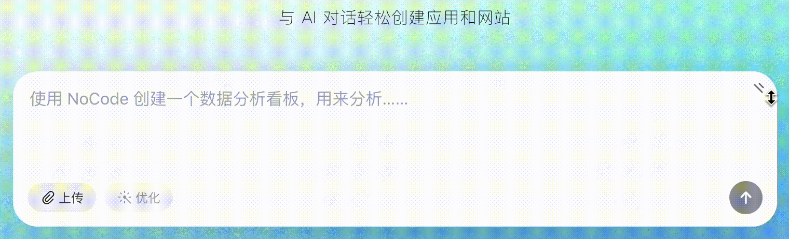 | 🌟 更好地联通想法和现实的桥梁, 提高设计师在团队的作用和「话语权」 |
|  | “你这个做的挺好的, 叫什么名字, 我搜一下” ......“噢只是UI稿” | **不被技术限制行动力**(lv1): 快速搭建demo、验证想法、收集反馈 | • [https://alii-ii.github.io/chat-input-demo/](https://alii-ii.github.io/chat-input-demo/) |  |
| 独立支持 | “我们要整一个大活” ......(没有研发资源)(文档又不是不能用) | **不被技术限制行动力**(lv2): 申请域名、开发功能、搭建网站, 自闭环简单业务需求 | • [设计部 AI Coding 活动 - 宣传 / 投票 / 颁奖](https://aicoding.meituan.com/) • [像素Keeta品牌资产平台 - 官方宣传 / 资源下载](https://km.sankuai.com/collabpage/2714311432#b-d1f3e20063844292a13379f75f8c7d44) | 🌟 更强的「闭环能力」, 离需求更近、离用户更近, 更自主、减少螺丝钉感 |

一个判断 是否适合介入 的参考指标: 「设计 :  开发」的时间比是否 ≤ 1 ?

题外话:

如果一个人能从“需求 - 设计 - 开发”闭环解决问题,

还需要写PRD、写设计说明、进行多轮多方评审、做设计验收吗?  敢问完成一个需求, 多少比例的时间在写文档、沟通,  多少时间在实打实做设计

还需要提高完成这些中间环节的效率吗?

> **设计师 Coding 的价值 —— 做更好的设计:**
> 去依赖、去信息差,  充分发挥设计师对「产品形态」的把控能力

### 2) 适合我吗?

> 有限案例的简单整理, 抛砖引玉为主

1. 什么样的设计师, 更适合尝试 AI Coding ?

|  |  |
| --- | --- |
| **个人特质** | **更容易上手的经历** |
| • 极强的自主性 • 梳理复杂逻辑让我觉得很有成就感 • 我思考很有结构性 • 我喜欢探索新知 • 我喜欢解释事物的规律和本质 • 我必须把一个问题想清楚 • 解决问题令我觉得兴奋 | • 参与过**设计系统**的维护和构建, 了解组件、全局样式的运作原理 • 有**复杂动效**实现与交付的经验, 熟悉代码参数的生效和串联逻辑 |
|  | **落地机会** |
|  | • 有缺少研发资源的需求 • 有信任并允许设计师 Coding 发挥的业务模块 |

1. 什么 Coding 领域, 更适合设计师?

   - **前端创意开发**: 精细的样式表现、巧妙的交互和动效...
   - **设计师是产品的用户 / 需求的甲方**: 体验优化、设计自驱...

1. 如果要接入业务, 什么条件比较适合尝试?

**✅ 适合**
- 难度较低:

  - 历史包袱小: 技术栈选型、架构设计、设计规范...
  - 模块简单
  - 协作团队比较开放
- 试错空间大:

  - 排期时间相对充裕
  - 风险低: 崩了或出Bug带来的后果在承受范围内

**🙅🏻 不适合**
- 难度高:

  - 历史包袱大: 大型产品或复杂业务, 需要遵循规范和复杂的规则...
  - 有比较复杂的耦合模块
  - 明细的组织分工
- 试错空间小:

  - 排期紧凑
  - 风险高: 崩了或出Bug会影响线上业务指标

### 3) 阶段参照(草稿)

> 有限案例的简单整理, 抛砖引玉;  代表性提炼, 非绝对划分.

| 阶段 | 例子 | 掌握的通用 Coding 操作 | 掌握的 AI Coding 用法 | 参照表现 | 参照背景 |
| --- | --- | --- | --- | --- | --- |
| 小白 | 完全没用过 AI Coding 产品 | 啥都不知道 | 对话、采纳 | 100% Vibe Coding | 愿意尝试、有想法 / 有需求 |
| 入门 | 完成过Vibe Coding产品开发 | IDE面板、终端、通用快捷键、本地预览、联通代码仓库、静态资源存储、Vibe Debug... | Restore回退 | • **能**: 半懂不懂, 反正能run • 小玩具开发自由, 实现静态样式 & 简单交互 | 设计侧: 框架化UI结构 代码侧: 前端基础入门(html/css)、Git、DevTool |
| 进阶 | • [https://jayzhushi.com/](https://jayzhushi.com/) • [Rico](https://www.xiaohongshu.com/user/profile/5f2b6903000000000101f51f?xsec_token=ABmVXSwrm50hkKCtqpzH3NayWmNy2B9wWVlh3VPoLxw3A=&xsec_source=pc_collect) | Git&分支、Mock数据、封装/调用组件、Debug、代码可用性“意识” | inline edit、@ | • **准**: 100%把握, 精准地实现静态样式&交互 • 能接入业务, 但需要专业工程师兜底 | 设计侧: 组件化思维、设计系统 & Design Token 代码侧: 后端基础入门、前端进阶入门 |
| 成熟 | • [Ryo](https://ryo.lu/) | 部署、打包、测试 等生产环境的完备流程 | 写个性化 AI Rules | **独立**闭环复杂前端、实现简易后端 | 代码侧: 更丰富的项目开发经验 |

> 友好的上手方式: 双线并行
> 1. 以解决自己的需求为出发点 —— 实践经验
> 2. 慢慢积累相关的核心概念 —— 系统知识
> 实现“半懂不懂 → 精准实现”的转变,  逐步扩大能力圈

延展: 部分前端技能树 & 对设计师的用途(主观整理)

| 模块 | 重要性 | 难度 | 明细 | 用途 | 不懂时会遇到的问题(包括但不限于) |
| --- | --- | --- | --- | --- | --- |
| 基础入门三件套 > 静态前端开发 | 必修 | ⭐ | • HTML (强烈推荐, 无论是否Coding了解都有好处): • **页面结构与常用标签**: div、span、a、img、main... | 定义页面结构 > 像设计稿一样, 看到页面的“定界框”, 看懂页面元素 | • 找不到想修改的模块代码在哪里 • 代码结构混乱、可读性差 |
|  | 必修 | ⭐ | 2. CSS (强烈推荐, 无论是否Coding了解都有好处): • **盒模型: **content 内容、padding 内边距、border 边框、margin 外边距 • **布局**: flex 行&列排列、grid网格排列 • **transform: **位移、旋转、缩放 • **filter**: 模糊、亮度、对比度、图层效果 • **animation 和 transition**: 动画曲线、过度变换规则 | 美化样式 > 串联 设计软件右侧面板 里的参数, 与实际的代码实现 | • 代码冲突, 样式不生效 • 布局错乱: 底部栏飞到了页面外 • 维护困难 |
|  | 选修 | ⭐ ⭐ | 3. JavaScript • **事件处理**: 监听点击、键盘输入、滚动等 • **动态渲染与控制**: 控制添加/删除元素、调用动画库、请求数据更新页面 • **Ajax / Fetch 请求**: 发起网络请求、动态加载内容 | 实现交互反馈 > 比“原型连线”自由度更高的产品交互设计 | • 想要按“这样”变化但死活实现不了 • 不理解 DOM 操作性能, 页面渲染卡顿 |
| DevOps与工程化 | 必修 | ⭐ | • Git • **commit / psuh**: 将当前分支的代码变更提交到仓库, 并附带每次提交的变更说明 • **merge**：将一个分支的改动合并进当前分支，保留多个分支的历史, 适合多人并行开发 | 多人协作与版本管理 > 职场生存技能 | • IDE 单机黑魂玩家, 改坏了就回退不了 • 无法多人协作 • 不会管理版本, 分支的代码丢失无法寻回 |
|  | 选修 | ⭐ | • 包管理器: • **npm / yarn / pnpm**: 安装、更新、删除、管理 JavaScript 库和工具 | 安装使用现成的库和工具 | • 版本冲突、依赖丢失 • 引入不必要的包, 导致代码臃肿、维护成本高 |
|  | 选修 | ⭐ ⭐ | • CI / CD (持续集成/持续部署) • **CI（Continuous Integration）**：每次代码 push 后自动运行测试、构建流程 • **CD（Continuous Delivery/Deployment）**：自动将构建好的代码部署到测试或生产环境 | 部署发布的自动化流水线 > 优化每次发布上线的人工操作流程 | • 每次更新都人工部署发布，效率低 • 部署不稳定或频繁出现上线问题 |
| 动效与可视化 | 选修 | ⭐ ⭐ | 开源动画库、svg动画、Framer Motion、Three.js...... | 「按需入坑」实现丰富的动画和交互效果 | • 实现不了炫酷的效果 |
| 前端框架 | 选修 | ⭐ ⭐ | • 技术栈: React、Vue、Swift(iOS开发)、Regular... • CSS样式: TailwindCSS.... | 「按需入坑」接入业务的前端技术栈 | • 写原始的 html+css+js, 无法供上线产品使用 |
| 浏览器与性能优化 | 必修 | ⭐ | • 开发者工具（DevTools） • **Console（控制台）**：输出日志、调试报错 • **Elements（元素面板）**：查看 HTML 和 CSS (强烈推荐, 无论是否Coding都适合了解) • **Network（网络面板）**：查看资源加载速度、状态码 • **Sources**：查看源码、打断点调试 JS • **Application**：查看缓存、本地存储、cookie • **Performance/Lighthouse**：检测网站性能指标 | 调试页面 • 页面加载慢，想知道哪个资源拖慢了 → 看 Network • 出现奇怪的样式问题 → 用 Elements 检查 DOM 和 CSS • 想排查 JS 错误或数据问题 → Console/Sources 打断点 | • **控制台調試 (Console Debugging)** 白屏但不知道哪裡出錯、看不懂錯誤信息 • **HTTP狀態碼 (HTTP Status Codes)** 不知道請求成功還是失敗、錯誤處理不當 |
|  | 选修 | ⭐ ⭐ | • 存储方式 & 缓存策略 • **存储类型&特性**: LocalStorage、sessiongStorage、IndexedDB、Service Worker... • **强缓存与协商缓存**: 用户每次打开页面时, 向服务器加载资源的机制 | 存储数据、优化加载机制 | • **fetch基礎 (Basic Fetch)** 數據拿不到、POST請求發不出去 • **Token存儲 (Token Storage)** 用戶刷新頁面就登出、token洩露安全風險 • **數據結構選擇 (Data Structures)** 查找慢、內存占用大、數據更新複雜 |
|  | 选修 | ⭐ ⭐ ⭐ | • 运行机制 & 性能优化 • **进程与线程模型**: 主线程负责执行 JS、UI 渲染, 子线程执行耗时任务，避免卡顿 • **性能优化**: 懒加载、预加载、压缩资源、SSR/静态化、代码分割** **按需加载... | 提高加载速度 | • **狀態管理 (State Management)** 數據不同步、組件間通信混亂、用戶操作後界面沒反應 • **浏览器渲染机制** 不必要的重排和重绘，降低页面性能 |

### 4) 实用技巧(探索中)

|  |  |
| --- | --- |
| • 借助图层结构, 理解代码结构 —— “看懂”代码 | 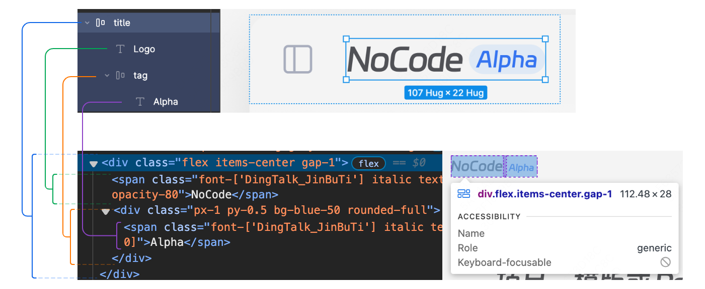 |
| • 布设好样式&属性, 通过CSS代码一步导入 —— 快速同步样式 | 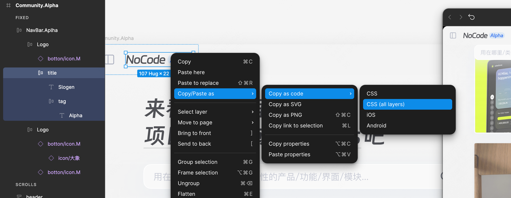 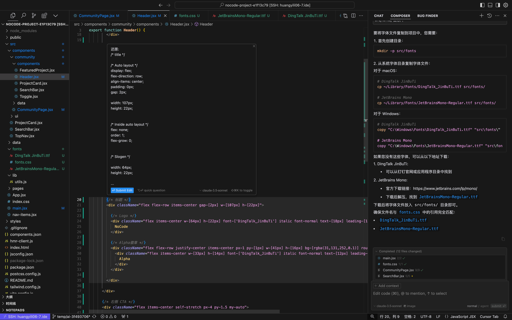 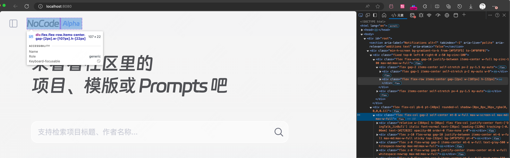 |
| • 学会用开发者工具预览页面、debug |  |
| • 多测试边界情况, 不要只测试 happy path |  |

> 更多, 需认证访问:

- [Keeta品牌资产平台: 参与真实项目 AI  Coding 经验](https://km.sankuai.com/collabpage/2714311432#b-d1f3e20063844292a13379f75f8c7d44)
- [设计部 AI Coding 活动官网首页自然语言 AI Coding](https://km.sankuai.com/collabpage/2710034497)
- [NoCode: AI Coding Tips 2024](https://km.sankuai.com/collabpage/2680413435)
- [来自UX设计师的vibe coding前端搭建指南](http://xhslink.com/a/uMxWbSHKs2Ofb)

---

> **AI Coding 入门概览 - 总结**:
> 1. 正确认识 AI Coding
>
>    - AI Coding 可以提高人的下限, 降低门槛, 让更多人通过 Coding 搭建简易产品, 实现自己的想法
>    - 想实现进阶的、生产级的目标, 需要掌握必要的专业知识和思维模式, 拓展 AI Coding 的上限
> 2. 善用 AI Coding 工具
>
>    - 简单、通用需求可以使用 AI 主导的 Coding 工具 / 产品模式
>    - 复杂、进阶需求适合使用专业的 AI 代码编辑器(IDE)
> 3. 设计师 AI Coding
>
>    - 最大的价值是去依赖、去信息差,  充分发挥设计师在「把控产品形态」领域的优势
>    - 需求驱动的边做边学, 慢慢积累相关的核心概念, 逐步扩大能力圈

# 附录

### 1) 拓展阅读
- [为什么你没有UI设计师必备的前端思维？](https://www.xiaohongshu.com/discovery/item/68493cd2000000002101b968?source=webshare&xhsshare=pc_web&xsec_token=ABfvNb3FZ__3ez2SctgMCinbqi6X95Xv1cUU0stHSgS6I=&xsec_source=pc_share)
- [UX如何与开发愉快工作](https://www.xiaohongshu.com/discovery/item/67fa82fb000000001d0166e0?source=webshare&xhsshare=pc_web&xsec_token=ABtQzQ6uz8X4Gi5EZXHLUOZ7dL3LNYt5BACoVhduO-dR8=&xsec_source=pc_share)
- [Vercel 关于设计工程师的介绍](https://www.xiaohongshu.com/discovery/item/6789c0b600000000190323a4?source=webshare&xhsshare=pc_web&xsec_token=ABiywr0xzgThduOh2ImJOX2VgpuQ2EL7aB6ggM6xmnAes=&xsec_source=pc_share)
- [设计求生之路：多面手](https://www.xiaohongshu.com/discovery/item/66c31c56000000001f01e764?source=webshare&xhsshare=pc_web&xsec_token=AB1QjGqxR6QqSt5lYHaBW-2RTeX9-5om-8TFlzVzHfKX8=&xsec_source=pc_share)
- [为什么设计师应该用ai转行builder](https://www.xiaohongshu.com/discovery/item/67f4e477000000001d023e4c?source=webshare&xhsshare=pc_web&xsec_token=AB9kpYtjX-UY6Bu9LFR48Wj0o59MTVGKKMeXNZTAWZp6I=&xsec_source=pc_share)
- [访谈｜Nad Chishtie — AI时代的产品设计新范式](https://www.xiaohongshu.com/discovery/item/68468487000000002200501c?source=webshare&xhsshare=pc_web&xsec_token=ABx4l1-WaCXoYe7WuZAcc_LZbmCswf2iW1Bvx5dpHO5k4=&xsec_source=pc_share)
Vibe Coding:
- [VibeCoding的5个宝藏场景实例](https://www.xiaohongshu.com/discovery/item/68045249000000001e009b3a?source=webshare&xhsshare=pc_web&xsec_token=ABjsiE6belDSWYpBaimkFOh_Khmab8ca4UI2pL0aJWGCA=&xsec_source=pc_share)
- [YC 关于 Vibe Coding 建议](https://www.xiaohongshu.com/discovery/item/680d8ff9000000001a00538b?source=webshare&xhsshare=pc_web&xsec_token=ABn3GtJKd2b4C45DIE7JPOltQw_1Mj3wsEVPXBs0MTeUM=&xsec_source=pc_share)
- [使用AI开发（Vibe Coding）的几条忠告](https://www.xiaohongshu.com/discovery/item/6836d31000000000220251f1?source=webshare&xhsshare=pc_web&xsec_token=ABMIpv-xZ_bDIWbFT7rT1YcWvvqG8Hoh-UVzuJ5dDeCXE=&xsec_source=pc_share)
- [AI编程救不了代码小白](https://www.xiaohongshu.com/discovery/item/67f69a5e000000001c01e1f1?source=webshare&xhsshare=pc_web&xsec_token=AB9zpQe-y9z-UrnpyDlqREgFjzgCcDk4KptVjR64-z0-s=&xsec_source=pc_share)
- [AI Coding 浪潮忽略的核心问题：责任与维护](https://www.xiaohongshu.com/discovery/item/6848e2c900000000030381c5?source=webshare&xhsshare=pc_web&xsec_token=AB3uhN2rarxBcea_xik4ER3boBG9Icj6lrJ7HPEzMr3qA=&xsec_source=pc_share)
- [你在AI编码的哪个阶段？](https://www.xiaohongshu.com/discovery/item/6842c0fc0000000022029345?source=webshare&xhsshare=pc_web&xsec_token=ABU9AWmKW-Mc8V_N4S-0g85iE9VDrfON5mSBydLurPrms=&xsec_source=pc_share)
- [vibe coding 理念对比: Cursor vs Devin](https://www.xiaohongshu.com/discovery/item/68444306000000000303d9e5?source=webshare&xhsshare=pc_web&xsec_token=ABkPSrR1leiDkF3SyQRXRY028bLQZx066XAT6bmyhfOkk=&xsec_source=pc_share)

### 2) 自学资料
- 全面了解: [文档｜HTML & CSS & JS](https://ropdkzp628.feishu.cn/docx/Die1d9QfpoxXAaxN80mcqNu2nWh)
- 立刻上手(认证访问): [文档 | 设计部 AI Coding FAQ](https://km.sankuai.com/collabpage/2707345127#b-e10de7b7c7b0477a8ddec2bba8dd8551)
豆知识:
- [博主 | AI Coding 豆知识](https://www.xiaohongshu.com/user/profile/55979288e4b1cf19a35c05a6?xsec_token=AB1GVz96MDHirUh3U5EqyJHJGRGAFW6DU5TWO5_85fBJs=&xsec_source=pc_note)
- [免费视频 | 设计师值得知道的开发扫盲知识](https://space.bilibili.com/345880241/lists/691006?type=season)
- [免费视频 | 白话科普: 网站部署的基本原理](https://www.bilibili.com/video/BV1hC4y187BN/?spm_id_from=333.788.videopod.sections&vd_source=9b96597b33ef1e7f48e462fe1f876ebf)
- [创意网站 | 像素是如何运作的 - makingsoftware.com](https://www.makingsoftware.com/)
按需入坑:
- [付费视频 | JS全面入门 - 复杂事件交互 + Canvas](https://www.bilibili.com/cheese/play/ss6998)
- [付费视频 | 后端入门 - Nodejs + Linux + Shell + Git](https://www.bilibili.com/cheese/play/ep268768)
- [免费视频 | React新手指南](https://space.bilibili.com/345880241/lists/4838717?type=season)
- [免费视频 | SVG动画 交互 从基础到高级效果实现](https://space.bilibili.com/345880241/lists/3590108?type=season)
- [免费视频 | Web3D基础认知](https://space.bilibili.com/345880241/lists/2095217?type=season)
- [文档 | Framer motion - 基于React最好的动效库](https://motion.framer.wiki/)

### 3) 资源分享

好用的动效库 / 组件库:
- [https://www.reactbits.dev/](https://www.reactbits.dev/)
- [https://motion.dev/](https://motion.dev/)
- [https://animejs.com/](https://animejs.com/)
- [https://21st.dev/](https://21st.dev/)
- [https://cursify.vercel.app/](https://cursify.vercel.app/)
- [https://www.ui-layouts.com/](https://www.ui-layouts.com/)
- [https://cssbuttons.io/](https://cssbuttons.io/)
- [https://css-loaders.com/square-circle/](https://css-loaders.com/square-circle/)

优质案例库 - web:
- [https://cssdesignawards.com/](https://cssdesignawards.com/)
- [https://www.footer.design/](https://www.footer.design/)
- [https://www.hoverstat.es/](https://www.hoverstat.es/)
- [https://aiverse.design/](https://aiverse.design/)
- [https://collectui.com/](https://collectui.com/)
优质案例库 - mobile:
- [https://www.spottedinprod.com/](https://www.spottedinprod.com/)
- [https://60fps.design/](https://60fps.design/)
